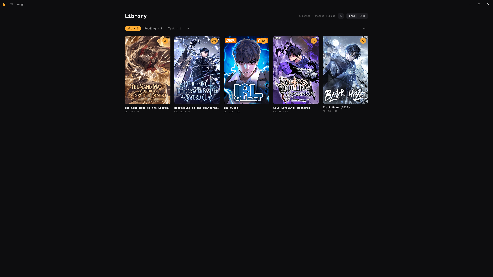
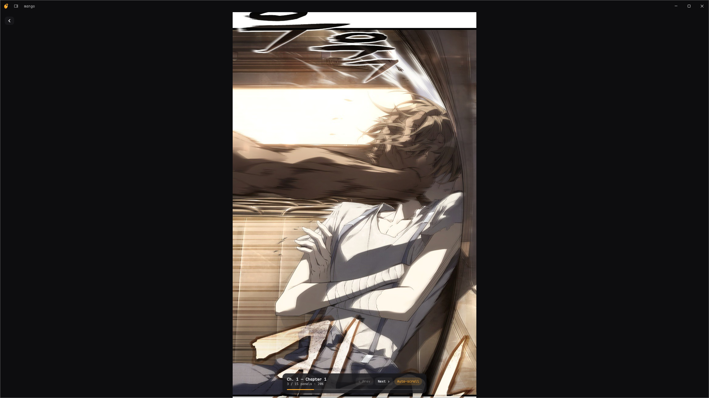
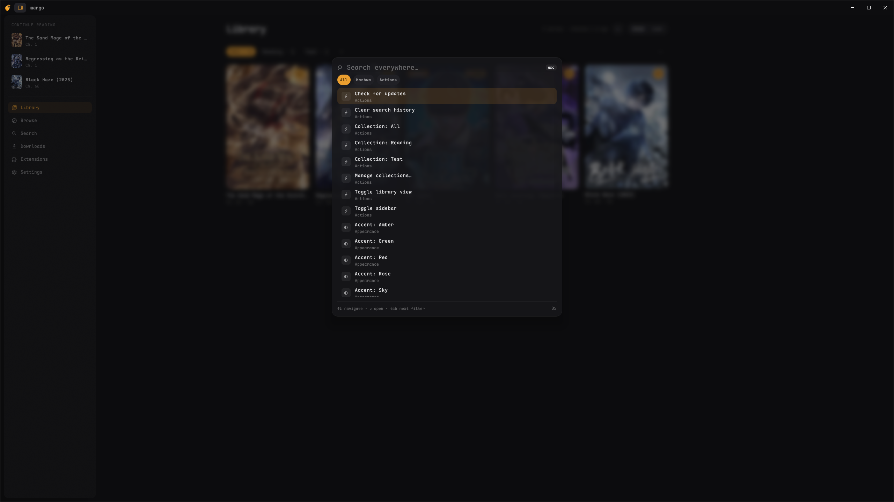
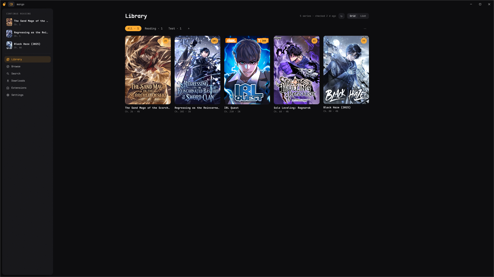

# mango

A manhwa reader for Windows desktop, written in Kotlin, that runs [Paperback](https://paperback.moe/) iOS extensions inside an embedded JavaScript engine.

<!-- screenshot: library grid view -->
**

## What it is

A personal project I was working on in an attempt to use Claude fully in an unfamiliar area for me. With the exception of this readme. 
I love the Paperback app on iOS to read manhwa, so I wanted to make an attempt at creating a similar experience thats easy on the eyes while 
also utilizing the extensions that the maintainers work so hard on.

Some features:
- Vertical webtoon reader with image prefetch, automatic next-chapter loading, and an auto-scroll mode
- Library with collections, read progress, and update checking
- Chapter downloads for offline reading
- Multi-source search
- Custom themes as plain JSON
- Cloudflare handling through an embedded browser window when needed

<!-- screenshot: reader with overlay bar -->
**

## Borrowed ideas

Two pieces of the interface are direct homages.

The command palette is inspired by IntelliJ's double-Shift. 
Tap Shift twice anywhere in the app and a search-everywhere palette opens: screens, every setting, 
every series in your library, etc.


The sidebar is inspirited by Arc browser. Just another neat way of navigating. Control+S to prompt it. 


## How the extensions work

Mango ships with zero sources built in. Instead it reuses Paperback 0.9 extensions written for the iOS app, published in public registries. 
Each extension knows how to talk to one specific manhwa site and turn its pages into structured data.

1. You install a source from the extensions screen. mango downloads that one JS bundle, checks its size and integrity, pins its checksum, and stores it locally. Every later load re-verifies the bundle against the pinned checksum, so a file that changes on disk is refused.
2. When you search, open a series, or load a chapter, mango spins up a fresh, throwaway JavaScript context in GraalJS, evaluates the bundle into it, and calls the same API the real Paperback app would call I believe.
3. The bundle can't touch anything by itself. There is no filesystem, no process access, no network. The only doorway to the outside world is a single injected `Application` object, implemented in Kotlin. When the extension wants a web page it has to ask through `Application.scheduleRequest`, and the Kotlin side is where all the policy lives: per-host rate limiting, request timeouts, per-source cookie storage.
4. The bundle parses the site's HTML or JSON however it likes and hands back plain data, which Kotlin validates again at the boundary before it becomes library entries, chapter lists, or page URLs.

When a source sits behind Cloudflare, no amount of polite HTTP gets through. mango detects the challenge, opens the actual site in an embedded Chromium window, lets you (or the browser) pass the check, then harvests the clearance cookies and pins the browser's exact user agent to that source, because the clearance is bound to it. From then on requests go through normally.

## How it was built

I wrote very little code by hand. The project ran as a structured loop with [Claude Code](https://claude.com/claude-code):

- A large model acted as the architect and decision maker. It planned milestones, made the design calls (module boundaries, the sandbox contract, the engine pivot), and wrote task briefs. It deliberately did not write bulk implementation code.
- Cheaper, faster models did the implementing, dispatched in parallel when tasks didn't overlap, each with a short brief: locked decisions, files to touch, acceptance criteria.
- A separate judge agent checked every completed batch: it diffed what actually changed against what the implementer claimed, and re-ran the tests before the work was accepted. "The implementer says it's done" was never treated as evidence.
- Code review ran as its own pass with a stronger model at every chunk boundary, mandatory for anything touching the sandbox or the network policy layer.

I did a lot of guiding, but that I believe was also because my requirements weren't very clear.

## Building and running

Requirements: JDK 17+ on Windows. Everything else is pulled by Gradle.

```
.\gradlew.bat :app:run        # run the app
.\gradlew.bat :core:jvmTest   # engine and data layer tests
.\gradlew.bat :app:jvmTest    # UI tests
```

WIP but for now - The merged custom title bar needs the app to run on a JetBrains Runtime; set `mango.jbrHome` in `~/.gradle/gradle.properties` to point at one. On a stock JDK the app falls back to the normal OS title bar.

Test fixtures (the extension bundles used by the engine tests) are not committed, the first test run downloads them from a pinned registry commit and verifies checksums.

## Disclaimer

mango is a reader, not a content source. It hosts no content, bundles no extensions, and has no affiliation with any manhwa site or with Paperback or Inkdex. 
Extensions are third-party code you choose to install. What you do with them is your responsibility. 
Support the official releases of the series you enjoy.

Licensed under [Apache-2.0](LICENSE).
